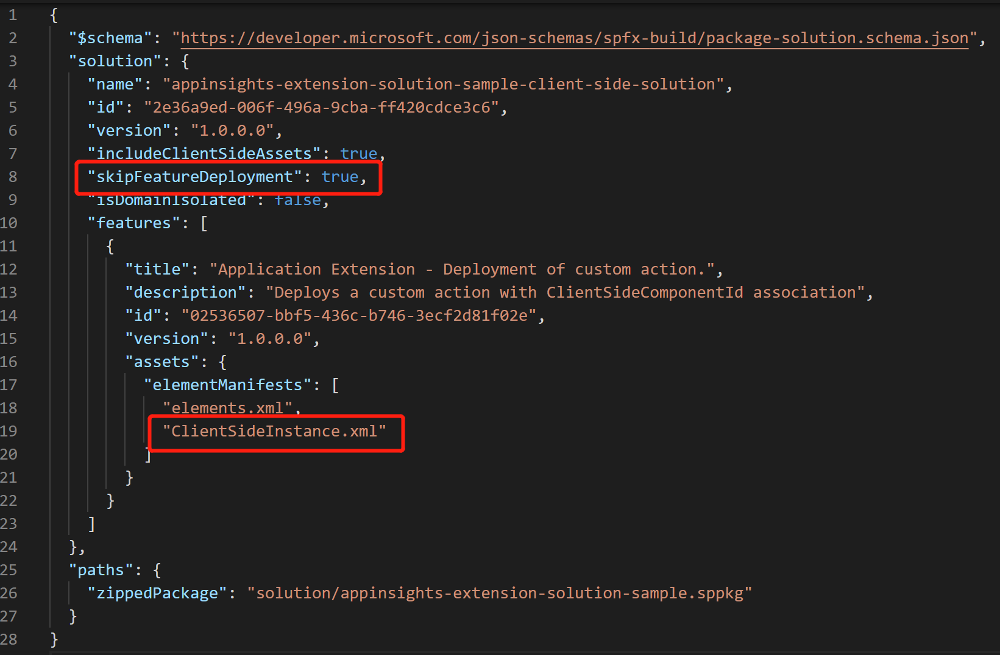
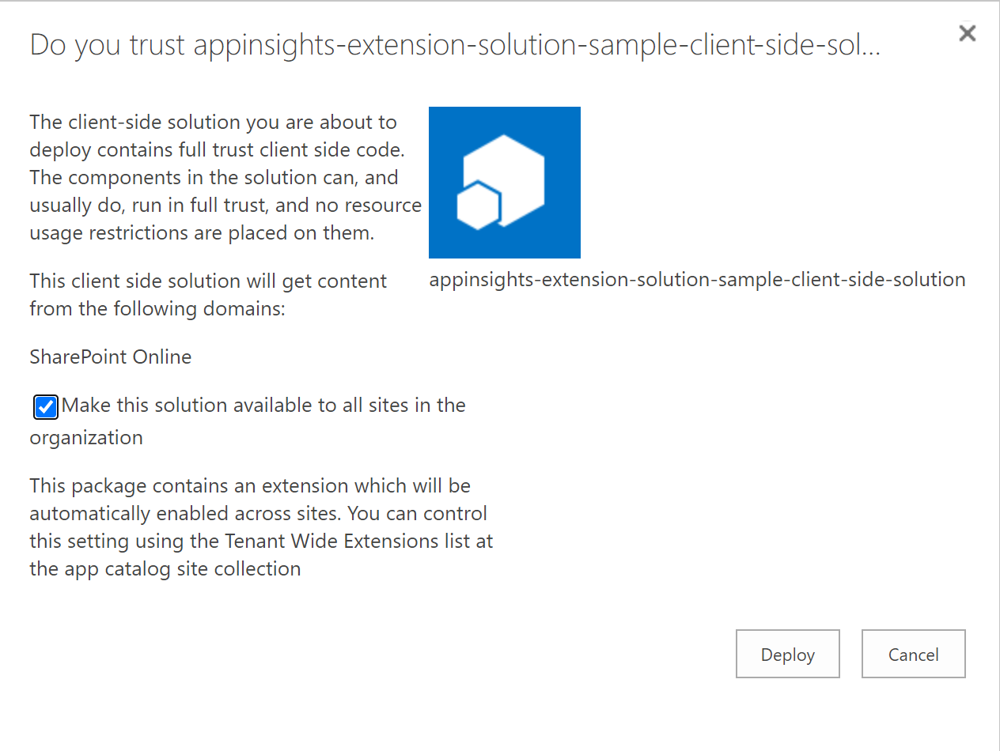
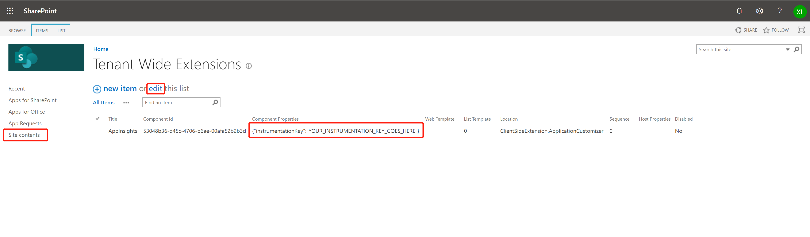
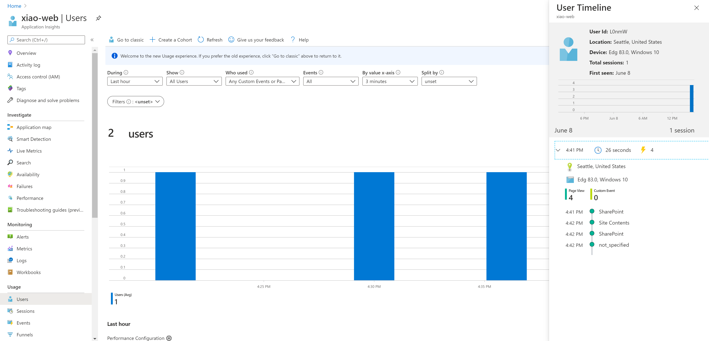
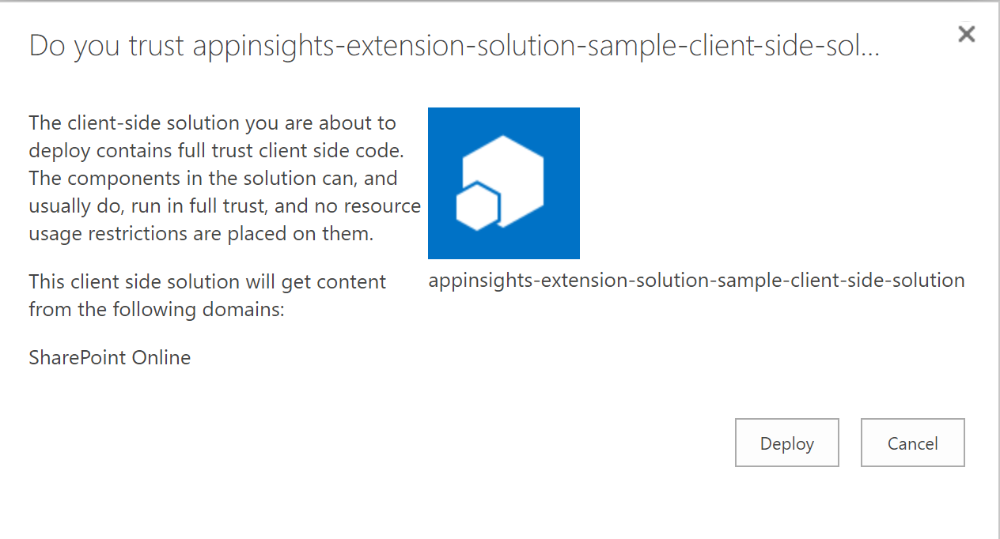
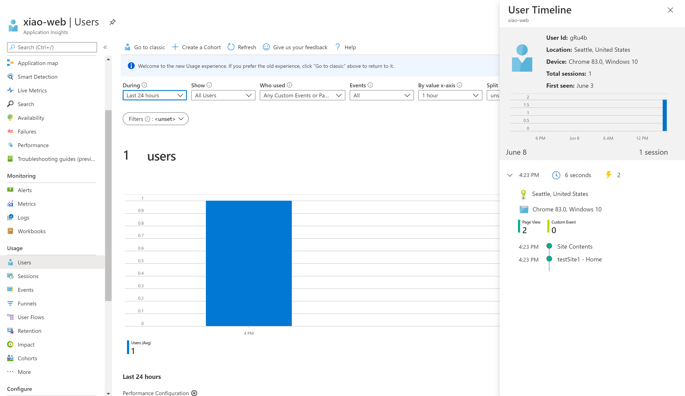

# How to create a SPFx extension solution with AppInsights installed from scratch

## Create an Application Insights Resource and find your instrumentationKey
Please find the instructions [here](https://docs.microsoft.com/en-us/azure/azure-monitor/app/create-new-resource).

## Set up Application Insights 
1. Follow [SPFx Extensions instruction](https://docs.microsoft.com/en-us/sharepoint/dev/spfx/extensions/get-started/build-a-hello-world-extension) to create a SharePoint Framework Extension.
2. Add Application Insights to your extension solution via one of the following two options:
    - Install via [NPM setup](https://github.com/microsoft/ApplicationInsights-JS#getting-started). Then, [set up an instance of Application Insights in your app.](#npm-setup-ignore-if-using-snippet-setup)
    - [Drop a script tag on the extension head.](#snippet-setup-ignore-if-using-npm-setup)

### NPM Setup (ignore if using Snippet Setup)
- Under your Extension solution src folder, update `ApplicationCustomizer.ts` file:

    a. [Set up Application Insights](https://github.com/microsoft/ApplicationInsights-JS#npm-setup-ignore-if-using-snippet-setup)
    ```js
    import { ApplicationInsights } from '@microsoft/applicationinsights-web'

    const appInsights = new ApplicationInsights({ config: {
    instrumentationKey: 'YOUR_INSTRUMENTATION_KEY_GOES_HERE'
    /* ...Other Configuration Options... */
    } });
    appInsights.loadAppInsights();
    appInsights.trackPageView(); // Manually call trackPageView to establish the current user/session/pageview
    ```

    b. Expose all [configuration options](https://github.com/microsoft/ApplicationInsights-JS#configuration) you need in the ApplicationCustomizerProperties interface.
    ```js
    export interface IAppInsightsApplicationCustomizerProperties {
        /* ...Other Configuration Options... */
        instrumentationKey: string;
    }
    ```
    c. Update appInsights instance config to map with exposed properties.
    ```js
    import { ApplicationInsights } from '@microsoft/applicationinsights-web'

    const appInsights = new ApplicationInsights({ config: {
    instrumentationKey: this.properties.instrumentationKey
    /* ...Other Configuration Options... */
    } });
    appInsights.loadAppInsights();
    appInsights.trackPageView(); // Manually call trackPageView to establish the current user/session/pageview
    ```

### Snippet Setup (Ignore if using NPM Setup)
- Under your Extension solution src folder, update `ApplicationCustomizer.ts` file:

    a. Expose all [configuration options](https://github.com/microsoft/ApplicationInsights-JS#configuration) you need in the ApplicationCustomizerProperties interface.
    ```js
    export interface IAppInsightsApplicationCustomizerProperties {
        /* ...Other Configuration Options... */
        instrumentationKey: string;
    }
    ```

    b. Drop a `<script>` tag on your extension head.
    ```js
    export default class AppInsightsApplicationCustomizer
    extends BaseApplicationCustomizer<IAppInsightsApplicationCustomizerProperties> {

        @override
        public onInit(): Promise<void> {
            Log.info(LOG_SOURCE, `Initialized ${strings.Title}`);

            let appInsightsScript: string = `!function(T,l,y){var S=T.location,u="script",k="instrumentationKey",D="ingestionendpoint",C="disableExceptionTracking",E="ai.device.",I="toLowerCase",b="crossOrigin",w="POST",e="appInsightsSDK",t=y.name||"appInsights";(y.name||T[e])&&(T[e]=t);var n=T[t]||function(d){var g=!1,f=!1,m={initialize:!0,queue:[],sv:"4",version:2,config:d};function v(e,t){var n={},a="Browser";return n[E+"id"]=a[I](),n[E+"type"]=a,n["ai.operation.name"]=S&&S.pathname||"_unknown_",n["ai.internal.sdkVersion"]="javascript:snippet_"+(m.sv||m.version),{time:function(){var e=new Date;function t(e){var t=""+e;return 1===t.length&&(t="0"+t),t}return e.getUTCFullYear()+"-"+t(1+e.getUTCMonth())+"-"+t(e.getUTCDate())+"T"+t(e.getUTCHours())+":"+t(e.getUTCMinutes())+":"+t(e.getUTCSeconds())+"."+((e.getUTCMilliseconds()/1e3).toFixed(3)+"").slice(2,5)+"Z"}(),iKey:e,name:"Microsoft.ApplicationInsights."+e.replace(/-/g,"")+"."+t,sampleRate:100,tags:n,data:{baseData:{ver:2}}}}var h=d.url||y.src;if(h){function a(e){var t,n,a,i,r,o,s,c,p,l,u;g=!0,m.queue=[],f||(f=!0,t=h,s=function(){var e={},t=d.connectionString;if(t)for(var n=t.split(";"),a=0;a<n.length;a++){var i=n[a].split("=");2===i.length&&(e[i[0][I]()]=i[1])}if(!e[D]){var r=e.endpointsuffix,o=r?e.location:null;e[D]="https://"+(o?o+".":"")+"dc."+(r||"services.visualstudio.com")}return e}(),c=s[k]||d[k]||"",p=s[D],l=p?p+"/v2/track":config.endpointUrl,(u=[]).push((n="SDK LOAD Failure: Failed to load Application Insights SDK script (See stack for details)",a=t,i=l,(o=(r=v(c,"Exception")).data).baseType="ExceptionData",o.baseData.exceptions=[{typeName:"SDKLoadFailed",message:n.replace(/\\./g,"-"),hasFullStack:!1,stack:n+"\\nSnippet failed to load ["+a+"] -- Telemetry is disabled\\nHelp Link: https://go.microsoft.com/fwlink/?linkid=2128109\\nHost: "+(S&&S.pathname||"_unknown_")+"\\nEndpoint: "+i,parsedStack:[]}],r)),u.push(function(e,t,n,a){var i=v(c,"Message"),r=i.data;r.baseType="MessageData";var o=r.baseData;return o.message='AI (Internal): 99 message:"'+("SDK LOAD Failure: Failed to load Application Insights SDK script (See stack for details) ("+n+")").replace(/\\"/g,"")+'"',o.properties={endpoint:a},i}(0,0,t,l)),function(e,t){if(JSON){var n=T.fetch;if(n&&!y.useXhr)n(t,{method:w,body:JSON.stringify(e),mode:"cors"});else if(XMLHttpRequest){var a=new XMLHttpRequest;a.open(w,t),a.setRequestHeader("Content-type","application/json"),a.send(JSON.stringify(e))}}}(u,l))}function i(e,t){f||setTimeout(function(){!t&&m.core||a()},500)}var e=function(){var n=l.createElement(u);n.src=h;var e=y[b];return!e&&""!==e||"undefined"==n[b]||(n[b]=e),n.onload=i,n.onerror=a,n.onreadystatechange=function(e,t){"loaded"!==n.readyState&&"complete"!==n.readyState||i(0,t)},n}();y.ld<0?l.getElementsByTagName("head")[0].appendChild(e):setTimeout(function(){l.getElementsByTagName(u)[0].parentNode.appendChild(e)},y.ld||0)}try{m.cookie=l.cookie}catch(p){}function t(e){for(;e.length;)!function(t){m[t]=function(){var e=arguments;g||m.queue.push(function(){m[t].apply(m,e)})}}(e.pop())}var n="track",r="TrackPage",o="TrackEvent";t([n+"Event",n+"PageView",n+"Exception",n+"Trace",n+"DependencyData",n+"Metric",n+"PageViewPerformance","start"+r,"stop"+r,"start"+o,"stop"+o,"addTelemetryInitializer","setAuthenticatedUserContext","clearAuthenticatedUserContext","flush"]),m.SeverityLevel={Verbose:0,Information:1,Warning:2,Error:3,Critical:4};var s=(d.extensionConfig||{}).ApplicationInsightsAnalytics||{};if(!0!==d[C]&&!0!==s[C]){method="onerror",t(["_"+method]);var c=T[method];T[method]=function(e,t,n,a,i){var r=c&&c(e,t,n,a,i);return!0!==r&&m["_"+method]({message:e,url:t,lineNumber:n,columnNumber:a,error:i}),r},d.autoExceptionInstrumented=!0}return m}(y.cfg);(T[t]=n).queue&&0===n.queue.length&&n.trackPageView({})}(window,document,{
            src: "https://az416426.vo.msecnd.net/scripts/b/ai.2.gbl.min.js", // The SDK URL Source
            //name: "appInsights", // Global SDK Instance name defaults to "appInsights" when not supplied
            //ld: 0, // Defines the load delay (in ms) before attempting to load the sdk. -1 = block page load and add to head. (default) = 0ms load after timeout,
            //useXhr: 1, // Use XHR instead of fetch to report failures (if available),
            crossOrigin: "anonymous", // When supplied this will add the provided value as the cross origin attribute on the script tag 
            cfg: { // Application Insights Configuration
                instrumentationKey: "` + this.properties.instrumentationKey + `"
            }});`;
            
            let script = document.createElement("script");
            script.type = "text/javascript";
            script.appendChild(document.createTextNode(appInsightsScript));

            document.head.insertAdjacentElement("beforeend", script);

            return Promise.resolve();
        }
    }
    ```
    c. Update appInsights instance config to map with exposed properties.


## Set up deployment configuration
### Select Option A or Option B for deployment based on your needs: 
The custom properties (eg. instrumentationKey in this example) is stored in several locations: 
1. When running a gulp serve and running the page in debug mode, the key that is stored in `config\serve.json` -> `properties` is passed to the page as querystring.
2. When deployed tenant wide, the key in `sharepoint\assets\ClientSideInstance.xml` -> `Properties` is used (Option A).
3. When the extension is installed on a site, the key in `sharepoint\assets\elements.xml` -> `ClientSideComponentProperties` is used (Option B).

The [AppInsightsExtensionSolutionSample](https://github.com/microsoft/ApplicationInsights-JS/tree/master/SPO/AppInsightsExtensionSolutionSample) is using Option A. We highly recommend you to create your own SPFx Extension solution, in order to get the full support of Application Insights and configure the SDK based on your needs.

### Option A - Deploy Extension solution Tenant wide (All sites share same configurations, including iKey)
4. Under your Extension solution config folder, set the skipFeatureDeployment attribute to true in the `package-solution.json` file. And add `ClientSideInstance.xml` file under `features\assets\elementManifests`.
<p></p>

5. Export properties you defined from `ClientSideInstance.xml` file.
    ```js
    <?xml version="1.0" encoding="utf-8"?>
    <Elements xmlns="http://schemas.microsoft.com/sharepoint/">
        <ClientSideComponentInstance
            Title="AppinsightsExtension"
            Location="ClientSideExtension.ApplicationCustomizer"
            ComponentId="96262ed0-fe5d-4786-abc2-9f6b9cb3fefc"
            Properties="{&quot;instrumentationKey&quot;:&quot;YOUR_INSTRUMENTATION_KEY_GOES_HERE&quot;}">
        </ClientSideComponentInstance>
    </Elements>
    ```
    
6. Run following command to create .sppkg file. Check [Host extension from CDN](https://docs.microsoft.com/en-us/sharepoint/dev/spfx/extensions/get-started/hosting-extension-from-office365-cdn) for reference.
    ```sh
    gulp bundle --ship
    gulp package-solution --ship
    ```
7. Open your tenant app catalog.
8. Click on Apps for SharePoint.
9. Upload the solution to the catalog.
10. Check the option Make this solution available to all sites in the organization .
<p></p>

> Now Application Insights web JS SDK is installed tenant wide on your SPO. If you need to edit configurations, you could do it through SharePoint UI: 

11. On your tenant app catalog page, go to Site Contents.
12. Open the list Tenant Wide Extensions.
13. Edit the ApplicationInsightsExtension item. For example, you can use a different instrumentationKey or set other configuration properties you set up in Set up Application Insights section.
<p></p>
14. Save the item and all your modern SharePoint site on Office 365 are ready to be monitored. If this was the first solution globally deployed on your tenant, it may take up to 20 minutes get available.
<p></p>

### Option B - Deploy Extension solution on a single site (Individual sites may use different configurations, including iKeys)
4. Remove skipFeatureDeployment attribute from `package-solution.json` file.
5. Export properties you defined from `elements.xml` file.
    ```js
    <?xml version="1.0" encoding="utf-8"?>
    <Elements xmlns="http://schemas.microsoft.com/sharepoint/">
        <CustomAction
            Title="AppInsights"
            Location="ClientSideExtension.ApplicationCustomizer"
            ClientSideComponentId="53048b36-d45c-4706-b6ae-00afa52b2b3d"
            ClientSideComponentProperties="{&quot;instrumentationKey&quot;:&quot;YOUR_INSTRUMENTATION_KEY_GOES_HERE&quot;}">
        </CustomAction>
    </Elements>
    ```
6. Run following command to create .sppkg file. Check [Host extension from CDN](https://docs.microsoft.com/en-us/sharepoint/dev/spfx/extensions/get-started/hosting-extension-from-office365-cdn) for reference.
    ```sh
    gulp bundle --ship
    gulp package-solution --ship
    ```
7. Open your tenant app catalog.
8. Click on Apps for SharePoint.
9. Upload the solution to the catalog.
10. Click Deploy.
<p></p>
11. On the site you want to install Application Insights, click "+New" -> App , to add appinsights extension to your site.

> Wait until the extension is added to your site, AppInsights Web JS SDK is installed on your site. With this option, you can not edit properties on SharePoint UI. If you change the AI configuration, you'll need to repeate Option B / step 6-11.
<p></p>

Check [AppInsightsExtensionSolutionSample-NPM](https://github.com/microsoft/ApplicationInsights-JS/tree/master/SPO/AppInsightsExtensionSolutionSample-NPM) for NPM setup example. 
Check [AppInsightsExtensionSolutionSample-Snippet](https://github.com/microsoft/ApplicationInsights-JS/tree/master/SPO/AppInsightsExtensionSolutionSample-Snippet) for Snippet setup example. 
