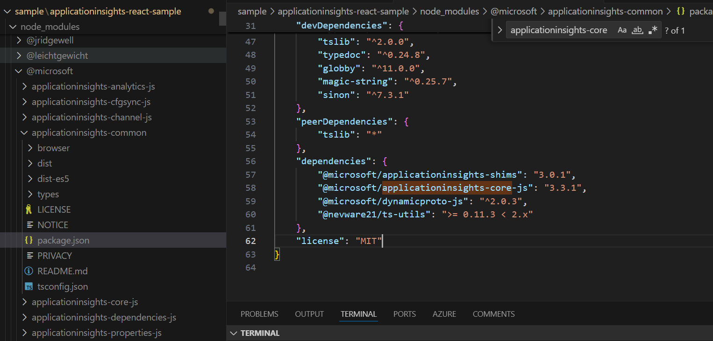

# Investigating and Solving Plugin-Type Errors in Extensions

This guide addresses plugin-type errors encountered when using the `applicationinsights-web` package alongside other extensions, such as `@microsoft/applicationinsights-react-js`, `@microsoft/applicationinsights-react-native`, and `@microsoft/applicationinsights-angularplugin-js`.

## Overview

A common error message associated with these issues might look like this:

```plaintext
Type 'ReactPlugin' is not assignable to type 'ITelemetryPlugin'.
```

Plugin-type errors often arise due to version mismatches between applicationinsights-web and its extensions.

## Reason 

When a new version of applicationinsights-web (which includes applicationinsights-core as a dependency) is released, package management tools may automatically update applicationinsights-core to the new version. However, if the extensions (e.g., React, Angular) have not been updated, their dependencies on applicationinsights-core may not match, leading to type errors.

## Steps to Investigate and Solve Plugin-Type Errors

### 1. Verify Package Versions

- **Check Dependencies**: Ensure that you have compatible versions of applicationinsights-common, applicationinsights-core, and any other related libraries. Look for discrepancies in your yarn.lock or package-lock.json or node_modules folder. 


### 2. Perform a Complete Update
The easiest way to ensure all dependencies are updated is to delete the node_modules folder and reinstall the packages:
```
rm -rf node_modules
npm install
```
### 3. Examples to follow
Here is a discussion that provide deeper insights into resolving these issues:
https://github.com/microsoft/applicationinsights-react-js/issues/95


  

