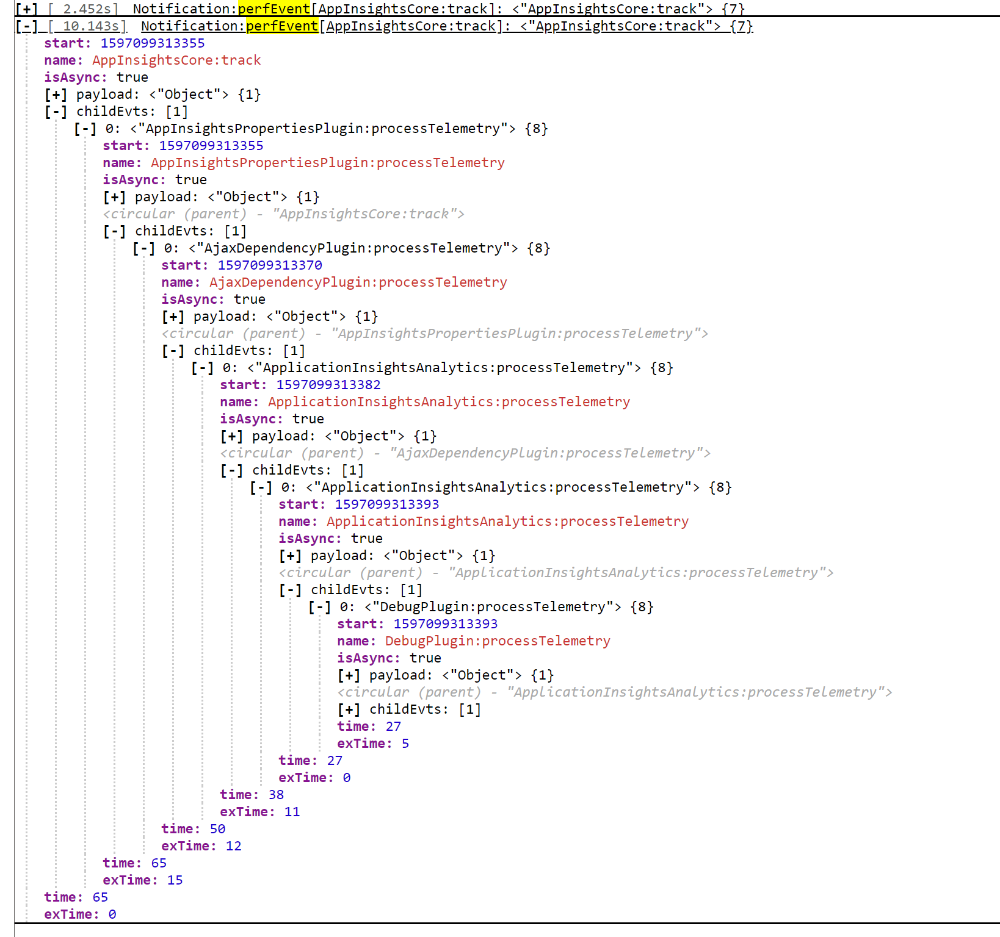

# Performance Monitoring (since v2.5.7)

The SDK now provides support for local client side performance monitoring and testing, this support does not send any telemetry or events to Azure Monitor as it has been designed to help developers validate and measure the performance of the SDK and any optional user instrumented code.

It can be enabled via configuration (_enablePerfMgr_) during initialization or by setting the performance manager directly on the Application Insights instance (_setPerfMgr()_).

The SDK comes with a default implementation of the performance manager which will fire the new [_perfEvent_ on the INotificationManager](https://github.com/microsoft/ApplicationInsights-JS/blob/main/shared/AppInsightsCore/src/JavaScriptSDK.Interfaces/INotificationManager.ts#L51), so you can receive a notification of these events by adding a INotificationListener which contains a [_perfEvent_](https://github.com/microsoft/ApplicationInsights-JS/blob/main/shared/AppInsightsCore/src/JavaScriptSDK.Interfaces/INotificationListener.ts#L38) implementation.

The easiest way to view and monitor these events in your running application/website would be to use the new [DebugPlugin extension](https://github.com/microsoft/ApplicationInsights-JS/blob/main/extensions/applicationinsights-debugplugin-js/README.md), which now listens and displays to the INotificationManager events.

The default INotificationManager implementation will (by default) only fire a _perfEvent_ for top level events, which are defined as events that have not occurred within the same execution cycle of a previous (incomplete) perf event. This behaviour can be changed to fire a _perfEvent_ for every instrumented section of code via the _perfEvtsSendAll_ configuration setting. Where the tracking of the current execution cycle of a performance event is automatically handled by the provided doPerf() helper.

Example of the IPerfEvents captured by the default IPerfManager using the [DebugPlugin extension](https://github.com/microsoft/ApplicationInsights-JS/blob/main/extensions/applicationinsights-debugplugin-js/README.md) to visualize the captured events.


## The interfaces

The SDK avoids (as much as possible) from directly using hard coded implementations and only uses the following interfaces as part of instrumenting the code for performance monitoring. This allows you to provide your own implementation to support your requirements at runtime and testing.

The only directly named class references are in the ApplicationInsight Core instances where they will create a [PerfManager](https://github.com/microsoft/ApplicationInsights-JS/blob/main/shared/AppInsightsCore/src/JavaScriptSDK/PerfManager.ts) instances when the _enablePerfMgr_ configuration is enabled. If you want to use your own performance implementation then do not enable the _enablePerfMgr_ configuration setting, and just call the _setPerfMgr()_ with your IPerfManager after the ApplicationInsights has been created.

### [IPerfManager](https://github.com/microsoft/ApplicationInsights-JS/blob/main/shared/AppInsightsCore/src/JavaScriptSDK.Interfaces/IPerfManager.ts)

#### Provides the basic interface for creating, monitoring and firing performance events

This interface is used by the system to start "create()" and complete "fire()" performance events, the default provided performance manager [PerfManager](https://github.com/microsoft/ApplicationInsights-JS/blob/main/shared/AppInsightsCore/src/JavaScriptSDK/PerfManager.ts) provides a simple implementation that will create a new [IPerfEvent](https://github.com/microsoft/ApplicationInsights-JS/blob/main/shared/AppInsightsCore/src/JavaScriptSDK.Interfaces/IPerfEvent.ts) instance for every call to it's create() function and will complete and fire a INotificationManager.perfEvent in response to calling it's fire() function.

The basic usage is that you call "create()" at the beginning of the segment of code that you want to measure and when the code is complete just call the "fire()" method with the IPerfEvent object returned from the create(). By following this pattern the implementation of the IPerfManager can control the exact implementation of IPerfEvent instance that is used for tracking the performance.

#### Methods of the IPerfManager

 * create(src: string, payloadDetails?: () => any, isAsync?: boolean): IPerfEvent - [Required] If the manager wants to instrument the named (_src_) code then it should return an IPerfEvent instance based on the _src; _payloadDetails_ and _isAsync_ arguments. The implementation may return null or undefined if it does not want to monitor this source (named) code.
   * src - [string] The source / name to be used for the performance event. May be used to determine whether the manager wants to create a IPerfEvent for the code.
   * payloadDetails -  [() => any] This is an optional callback function which is used to assign the _payload_ value of the IPerfEvent, to limit the performance impacts the implementation should only call this callback if it is returning an IPerfEvent AND it needs the value.
   * isAsync - [Boolean] An optional flag identifying whether the code is being executed as part of a synchronous / asynchronous request, used by the default implementation to determine how it should fire the INotification.perfEvent. Defaults to true when not supplied.
 * fire(perfEvent:IPerfEvent): void - [Required] The performance manager should mark the passed _perfEvent_ as complete and fire the performance event.
   * perfEvent - [IPerfEvent] This will be the value returned by the create() function.
* setCtx(key: string, value: any): void - [Required] Allows users to set a named context value, setting the same named value will overwrite any previous value, it should also allow setting the value to null or undefined. This is used via the doPerf() helper to track the currently executing IPerfEvent instance for identifying the parent / children for each event.
* getCtx(key: string): any - [Required] Return any previously named value that was set.

### [IPerfEvent](https://github.com/microsoft/ApplicationInsights-JS/blob/main/shared/AppInsightsCore/src/JavaScriptSDK.Interfaces/IPerfEvent.ts)

#### The basic interface used to generate performance event metrics for instrumented code

This is a generic interface for holding the details about the instrumented chunk of code, the SDK does not directly create instances of this interface but rather uses the instances returned via the IPerfManager.create().

#### The fields of the IPerfEvent

 * name - [string] The name of the performance event. Examples "AppInsightsCore:track" "AppInsightsPropertiesPlugin:processTelemetry
 * start - [number] The start time of the event, the actual value is dependent on the IPerfManager implementation, it could be in relative, absolute in milliseconds or nanoseconds. The provided default IPerfManager currently uses the absolute time in milliseconds (via Date.now()).
 * payload - [object] This is a copy / reference to the value provided during the call to the IPerfManager.create().
 * isAsync - [boolean] Identifies if the perfEvent is occurring via a synchronous or asynchronous execution path, primarily used to determine how to fire the _INotificationManager.perfEvent()_.
 * time - [number] Identifies the total amount of time (since the start to end) that this perfEvent represents. This value may be undefined until the event has completed (depending on the IPerfManager implementation).
 * exTime - [number] Identifies the exclusive amount of time (since the start to end) that this perfEvent represents. This effectively is the "time" less the sum of the "time" of all children.
 * parent - [IPerfEvent] An optional reference to the parent event that was active when this event was created.
 * childEvts - [Array&lt;IPerfEvent&gt;] An optional array of all child events started before this event completed.

#### Methods of the IPerfEvent

 * getCtx?: (key: string) => any - [Optional] Returns any previously set context for the event, can be used by the instrumented code to set additional context to be reported or tracked for the performance event. The doPerf() Helper uses this function to get the child event value array for appending.
 * setCtx?: (key: string, value: any) => void - [Optional] Allows the instrumented code to set additional context to be reported or tracked for the performance event. The doPerf() Helper uses this function to set the parent, child event values and if an exception occurred during execution.
 * complete: () => void - [Required] - When called, the tracked event should be marked as complete. The default provided IPerfManager calls this method during it's call to fire() to mark the event as complete.

## Provided Implementation helper

### [doPerf()](https://github.com/microsoft/ApplicationInsights-JS/blob/main/shared/AppInsightsCore/src/JavaScriptSDK/CoreUtils.ts#L498)

#### Helper method that is used by the SDK to wrap the code to be measured

This is the primary helper used by the SDK to instrument a block of code that we have identified as a critical block that should be monitored / tested. We have exported this helper to allow you to instrument your own code as part of the normal execution cycle.

It is designed as a wrapper implementation where the 3rd argument _func_ is the code that is being monitored. The implementation handles cases where a performance manager is not enabled or available, so it is safe for you to include this into production code.

##### Signature

The helper uses callback functions for constructing the source (_name_ of the event) and details (_payload_ of the event) to avoid any expensive string or object construction when performance monitoring is not enabled.

doPerf<T>(mgrSource: IPerfManagerProvider | IPerfManager, getSource: () => string, func: (perfEvt?: IPerfEvent) => T, details?: () => any, isAsync?: boolean) => T

 * mgrSource - [[IPerfManager|IPerfManagerProvider](https://github.com/microsoft/ApplicationInsights-JS/blob/main/shared/AppInsightsCore/src/JavaScriptSDK.Interfaces/IPerfManager.ts)] This can be either the IPerfManager or a provider that returns the IPerfManager (via the _getPerfMgr()_) instance. All Application Insights core instances are IPerfManagerProvider instances, so you can just the current Application Insights instance. The value may also be null or undefined, which means no perf event will be tracked.
 * getSource - [() => string] Callback function to return the _name_ for the perf event, this is only called when the performance monitoring is enabled and the value is passed to the IPerfManager.create() function.
 * func - [() => T] This is the actual code whose performance will be monitored / tracked, the return value of this function is the value returned by the doPerf() helper.
 * details - [() => any] This is an optional callback function which is used to assign the _payload_ value of the IPerfEvent, the callback function is passed to the IPerfManager.create() method and will only be called if the performance mananger creates an IPerfEvent for the request, to limit the performance impact that monitoring can introduce.
 * isAsync - [Boolean] An optional flag identifying whether the code is being executed as part of a synchronous / asynchronous request. Defaults to true when not supplied.

Example usage
```typescript

public myFunction(someArgument: any) {
    return doPerf(appInsights, () => rootName + ":myFunction", () => {
        // This is the code that will be instrumented

        // As a wrapper the doPerf supports returning the value returned by the func argument
        return true;
    }, () => ({ details: someArgument, retry: 1 }));
}

```
