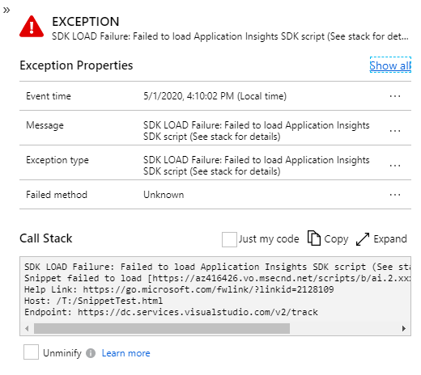

# SDK Load Failure: Failed to load Application Insights SDK script (see stack for details)

This exception is created and reported by the snippet (v3 or later) when it detects that the SDK script failed to download or initialize. Simplistically, your end users client (browser) was unable to download the Application Insights SDK, or initialize from the identified hosting page and therefore no telemetry or events will be reported.

<p></p>

> :bulb: **Note**
>
> This exception is supported on all major browsers that support the fetch() API or XMLHttpRequest, this therefore explicitly excludes IE 8 and below, so you will not get this type of exception reported from those browsers (unless your environment includes a fetch polyfill).

## What does this exception mean?

There are many possible reasons for this exception to be reported, we will cover some of the known issues as well the details to diagnose the root cause of the problem.

<p></p>

The stack details include the basic information with the URLs being used by the end user and is formatted as below

> SDK LOAD Failure: Failed to load Application Insights SDK script (See stack for details)<br />
> Snippet failed to load [__&lt;CDN&nbsp;Endpoint&gt;__] -- Telemetry is disabled<br />
> Help Link: __&lt;Help&nbsp;Link&gt;__<br />
> Host: __&lt;Host&nbsp;URL&gt;__<br />
> Endpoint: __&lt;Endpoint&nbsp;URL&gt;__<br />

| Name | Description
|----------------------|------------
| &lt;CDN&nbsp;Endpoint&gt; | The URL that was used (and failed) to download the SDK
| &lt;Help&nbsp;Link&gt;    | A help link URL that links to this page
| &lt;Host&nbsp;URL&gt;     | The complete URL of the page that the end user was using
| &lt;Endpoint&nbsp;URL&gt; | The URL that was used to report the exception, this value may be helpful in identifying whether the hosting page was accessed from the public internet or a private cloud.

## Why did this exception occur?

There are many possible reasons for this exception to be reported, and the most common ones are described below with links to corresponding troubleshooting steps.

> :bulb: **Note**
>
> Several of the Troubleshooting steps assume that your application has direct control of the Snippet &lt;script /&gt; tag and it's configuration that are returned as part of the hosting HTML page. If you don't then those identified steps will not apply for your scenario.

## The Application Insights JS CDN has been blocked

While typically NOT the cause for this exception, we recommend you rule it out first since there are limited options for you or your end users and may require immediate external assistance.

### Troubleshooting

- [Check if the CDN has been blocked](SdkLoadFailureSteps.md#cdn-blocked)
- [Change the URL used to download the SDK](SdkLoadFailureSteps.md#change-the-cdn-endpoint)
- [Host the SDK on you own CDN](SdkLoadFailureSteps.md#host-sdk)
- [Use NPM packages to embed the Application Insights SDK](SdkLoadFailureSteps.md#use-npm).

## Intermittent network connectivity failure

This is the most common reason for seeing this exception, though it may seem largely out of the developer's control. It's especially common in a mobile roaming scenario where the user looses network connectivity intermittently.

To minimize this issue, we have implemented Cache-Control headers on all of the CDN files so that once the end users browser has downloaded the current version of the SDK it will not need to downloaded again and the browser will reuse the previously obtained copy (see [How caching works](https://docs.microsoft.com/azure/cdn/cdn-how-caching-works)). If the caching check fails or there has been a new release, then your end users browser will need and download the updated version, so you may see a background level of _"noise"_ in the check failure scenario or a temporary spike when a new release occurs and is made generally available (deployed to the CDN).

If this exception is persistent and is occurring across many of your users (diagnosed by a rapid and sustained level of this exception being reported) along with a reduction in normal client telemetry, then intermittent network connectivity issues is _not-likely_ to be the true cause of the problem and you should continue diagnosing with the other known possible issues below.

### Troubleshooting

- [Intermittent Network failure](SdkLoadFailureSteps.md#intermittent-network-failure)
- [Use NPM packages to embed the Application Insights SDK](SdkLoadFailureSteps.md#use-npm).

> :bulb: **Note**
>
> Due to the caching headers on the CDN files and depending on how often and when your users access your site, not all of them will attempt to download the newer version at the same point in time, so reports may be staggered.

## Application Insights JS CDN is blocked (by End User - blocked by browser; installed blocker; Personal firewall)

Check if your end users have installed: -
- a browser plug-in (typically some form of Ad/Malware/Popup blocker);
- blocked (or not allowed) the Application Insights CDN endpoints in their browser or proxy; 
- or configured a firewall rule that is causing the CDN domain for the SDK to be blocked (or the DNS entry to not be resolved).

If they have configured any of these options, you will need to work with them (or provide documentation) to allow the CDN endpoints.

It is also possible that the plug-in they have installed is using the [public blocklisting](SdkLoadFailureSteps.md#cdn-blocked), which is why that option is listed first, if you get here then it's most likely some other manually configured solution or it's using a private domain blocklisting.

### Troubleshooting

- [Check if CDN has been blocked](SdkLoadFailureSteps.md#cdn-blocked)
- [Change the URL used to download the SDK](SdkLoadFailureSteps.md#change-the-cdn-endpoint)
- [Add exceptions for CDN endpoints](SdkLoadFailureSteps.md#add-exceptions-for-cdn-endpoints)
- [Host the SDK on you own CDN](SdkLoadFailureSteps.md#host-sdk)
- [Use NPM packages to embed the Application Insights SDK](SdkLoadFailureSteps.md#use-npm).

> :bulb: **Note**
>
> For this exception to be reported, they would not be blocking the reporting endpoint (otherwise you would not see the exception).

## Application Insights CDN is blocked (by Corporate firewall)

If your end users are on a corporate network, then they are most likely behind some form of firewall solution and it's likely that their IT department has implemented some form of internet filtering system. In this case, you will need to work with them to allow the necessary rules for your end users.

### Troubleshooting

- [Check if CDN has been blocked](SdkLoadFailureSteps.md#cdn-blocked)
- [Change the URL used to download the SDK](SdkLoadFailureSteps.md#change-the-cdn-endpoint)
- [Add exceptions for CDN endpoints for corporations](SdkLoadFailureSteps.md#corporate-exceptions-for-cdn-endpoints)
- [Host the SDK on you own CDN](SdkLoadFailureSteps.md#host-sdk)
- [Use NPM packages to embed the Application Insights SDK](SdkLoadFailureSteps.md#use-npm).

> :bulb: **Note**
>
> For this exception to be reported, they would not be blocking the reporting endpoint (otherwise you would not see the exception).

## Application Insights CDN outage

You can confirm this scenario by attempting to access the CDN endpoint directly from the browser (for example, https://js.monitor.azure.com/scripts/b/ai.2.min.js) from a different location to that of your end users (probably from your own development machine - assuming that your organization has not blocked this domain).

### Troubleshooting

- [Create a support ticket](https://azure.microsoft.com/support/create-ticket/) with details of the outage and the CDN endpoint that is experiencing the issue. 
- [Change the URL used to download the SDK](SdkLoadFailureSteps.md#change-the-cdn-endpoint)

### SDK failed to initialize after loading the script

There are several possible reasons that may cause the script to fail during initialization, when this occurs the SDK &lt;script /&gt; was successfully downloaded from the cdn but it fails during initialization. This issue can be because of one or more missing dependencies; invalid or some form of JavaScript exception.

The first thing to check is whether the SDK was successfully downloaded, if the script was NOT downloaded then this scenario is __not__ the failing scenario.

Quick check: Using a browser that supports Developer tools (F12), validate on the network tab that the script defined in the ```src``` snippet configuration was downloaded with a response code of 200 (success) or a 304 (not changed). You could also use a tool like fiddler to review the network traffic.

### Troubleshooting

- [SDK Failed to initialize](SdkLoadFailureSteps.md#sdk-failed-to-initialize)

## <a name="next"></a> Next steps
* [Get additional help by filing an issue on GitHub](https://github.com/Microsoft/ApplicationInsights-JS/issues)
* [Back to Snippet setup](https://github.com/microsoft/ApplicationInsights-JS/blob/main/README.md#reporting-script-load-failures)

## Other Script caused loading failure (by require js)

If users load Application Insights from the CDN via a script tag with require js running by other scripts, errors may occur. A typical error could be "Error: Mismatched anonymous define() module".
Check [here](https://github.com/microsoft/ApplicationInsights-JS/blob/main/README.md#module-formats) for more details.

### Troubleshooting
- Check if other script is calling require js
- Check if require js is loaded first before script is loaded

### Suggested walkaround solution
- if using load from cdn, instead of using 3.x.x.min.js, use 3.x.x.gbl.min.js instead. 
