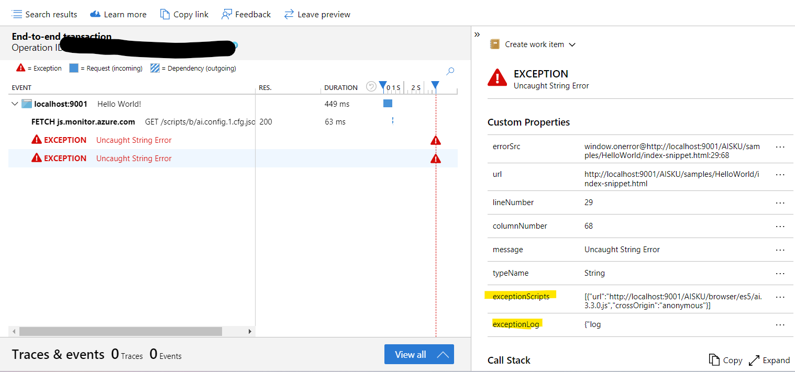

## Add More Information to Exception Telemetry

To enhance the detail and usefulness of exception telemetry in your application, you can configure additional settings through the `IExceptionConfig` interface. This allows for more comprehensive data to be included when exceptions are sent, such as scripts loaded on the page.

### Configuration

| Property | Type | Default | Description |
| --- | --- | --- | --- |
| expCfg | [`IExceptionConfig`](https://github.com/microsoft/ApplicationInsights-JS/blob/main/shared/AppInsightsCommon/src/Interfaces/IExceptionTelemetry.ts) | `undefined` | Set additional configuration for exceptions, such as more scripts to include in the exception telemetry. |

### Example Usage
```js
const appInsights = new ApplicationInsights({
    config: {
        connectionString: 'InstrumentationKey=YOUR_INSTRUMENTATION_KEY_GOES_HERE',
        expCfg: {
            inclScripts: true,
            expLog : () => {
                return {logs: ["log info 1", "log info 2"]};
            },
            maxLogs : 100
        }
    }
});
appInsights.trackException({error: new Error(), severityLevel: SeverityLevel.Critical});
```

### Where could I find those extra information?
The extra info is added as properties into exception Telemetry.
For script information, it would be stored under properties[exceptionScripts].
For log information, it would be stored under properties[exceptionLog].
You could find the info as shown in the pic:
