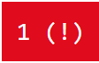
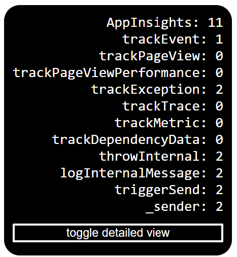
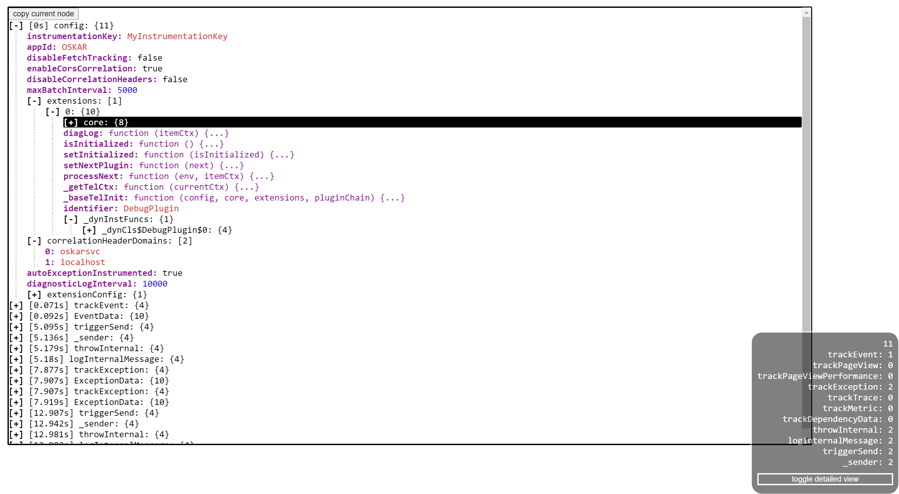
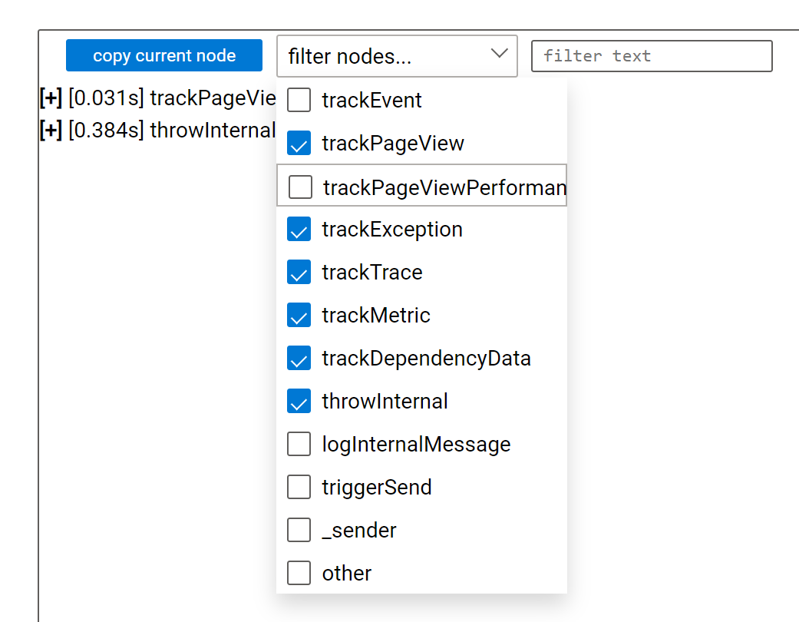
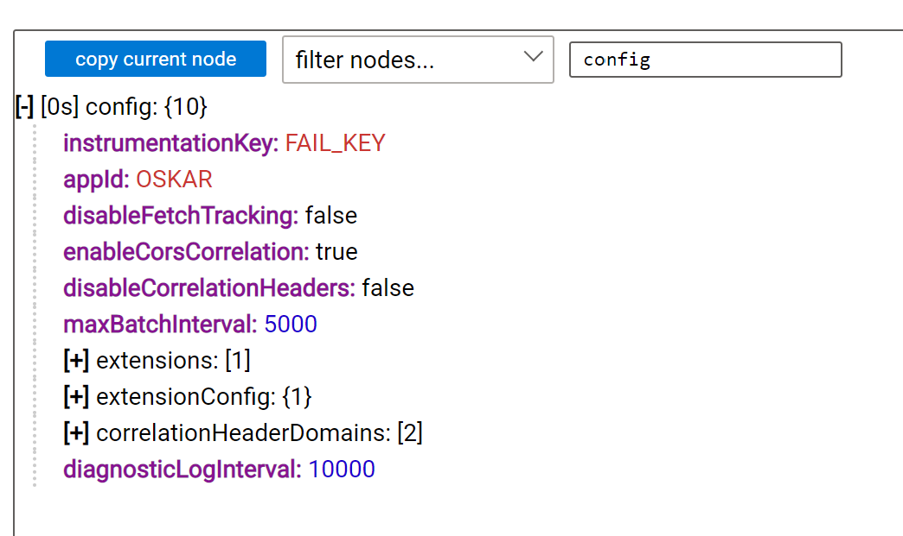

# Microsoft Application Insights JavaScript SDK - Debug Plugin

## [BETA]


[](https://github.com/microsoft/ApplicationInsights-JS/tree/master)
[](https://dev.azure.com/mseng/AppInsights/_build/latest?definitionId=8184&branchName=master)
[](https://badge.fury.io/js/%40microsoft%2Fapplicationinsights-debugplugin-js)
[](https://img.badgesize.io/https://js.monitor.azure.com/scripts/b/ext/ai.dbg.2.min.js.svg?compression=gzip&softmax=20000&max=25000)
[](https://img.badgesize.io/https://js.monitor.azure.com/scripts/b/ext/ai.dbg.2.min.js.svg?label=minified%20size)

This README is broken down into several parts:

- **Who** should use this plugin
- **What** this plugin does
- **When** to use this plugin
- **Where** to get more information
- **Why** this plugin exists
- **Getting Started**
- **Supported Browsers**
- **Breaking Changes**
- **Contributing**

these parts go together to explain the reasoning for this plugin's existance and provides
an explaination as to how everything works. Each of these sections will finish with a
bullet-point list that summarizes the section

## Who Should Use This Plugin

This plugin is tailored towards *developers* that utilize or are familiar with this
Application Insights Javascript SDK. This can also be used by various customer support services,
or those that just wish to dig into things to get a better understanding of how it all works.

This plugin should **not** be included in a finalized website. This is not for the end-user.

In short:

- Developers
- Customer Support services
- **not** the end-user

## What This Plugin Does

### The AppInsight Box

This plugin dynamically injects dynamic components into the webpage to provice a rich debugging
experience for Application Insights JS. Upon initialization, there will be a blue
box with a number in the bottom-right corner of the screen:


Upon hover, it will prepend "AppInsights" to the number:


This number is here to indicate the total number of calls to tracked functions, such as
`trackEvent` or `trackPageView`. By default, every useful function is tracked.

When there's an error (`trackException`), a `(!)` will be appended to the number within the
box like so:



When this bbox is clicked, it will expand to a more detailed view, showing the frequency
of each tracked function call. It will also get rid of the error indicator:



This box can be clicked once more to minimize it.

### The Detailed View

When the box is open, clicking the "toggle detailed view" button will bring down a view
that shows a list of event objects. By clicking on one of these objects, you can open it up
in tree-view fasion:



This is modeled after the developer tools of Chrome/Edge to keep things familiar.

Each node that can be opened further has a `[+]` before it, whereas ones that can be minimized will
have a `[-]` before it. Nodes like this also have their type, that being object or array, denoted
next to them with `{}` or `[]` respectively. Between these braces/brackets will be a number.
This number shows the number of entries within that object or array.

There a button above these entries that says "copy current node." This button will, if a node is
selected, copy the node and its children up to a certain depth to the clipboard as a JSON string.
This will also handle circular references.

It's possible to traverse this tree view using a keyboard:

- `Left` will close a currently-open node / go to the previous level
- `Right` will open a node and go to the next level
- `Up/Down` will move through the current level
- `Ctrl+C` will copy the current node to the clipboard as a JSON object

there are also two ways of filtering the data. This is useful if there are a lot of nodes on the screen
when only one is important.



The "filter nodes" box will filter the individual node types based on their
telemetry call.



The other, "filter text," enables the user to search and display only the nodes that have
whatever was typed in the box somewhere within their tree.

## When Should This Plugin Be Used

This plugin is used when:
- data isn't reaching azure
- things don't appear to be tracked
- something is crashing and developers are unsure if the plugin is causing it

## Where to get More Information

TBD

## Why This Plugin Exists

ApplicationInsights-js has lacked a solid way to debug issues for awhile now. Often, developers
had to dig through code and go to a multitude of different areas to even begin diagnosing an issue.

The impact of all of these will bring about a much better development experience for those using
ApplicationInsights-js. Just the fact that they are able to see when a function is fired will
dramatically cut-down on time spent diagnosing and eliminating bugs. The tree view will foster
communication between developers and testers, allowing them to copy and send important pieces of data
elsewhere.

Instead of needing to come to the ApplicationInsights-js team with every bug encountered, in many
cases developers will be able to use these tools to diagnose things that are going wrong on their own
thanks to this new layer of transparency.

## Getting Started

run the following console command to install appInsights and the debug plugin:

```zsh
npm install --save @microsoft/applicationinsights-debugplugin-js @microsoft/applicationinsights-web
```

## Basic Usage

### NPM Setup (ignore if using Snippet Setup)

```js
import { ApplicationInsights } from '@microsoft/applicationinsights-web';
import { DebugPlugin } from '@microsoft/applicationinsights-debugplugin-js';

const toTrack = [
    'trackEvent',
    'trackPageView',
    'trackPageViewPerformance',
    'trackException',
    'trackTrace',
    'trackMetric',
    'trackDependencyData',
    'throwInternal',        // called when a message is logged internally
    'logInternalMessage',   // called when a message is logged internally
    'triggerSend',          // called when data is queued to be sent to the server
    '_sender',              // called when data is sent to the server
];

const debugPluginInstance = new DebugPlugin();
const appInsights = new ApplicationInsights({
    config: {
        connectionString: 'InstrumentationKey=YOUR_INSTRUMENTATION_KEY_GOES_HERE',
        extensions: [debugPluginInstance],
        extensionConfig: {
            [DebugPlugin.identifier]: {
                trackers: toTrack
            }
        }
    }
});
appInsights.loadAppInsights();
appInsights.trackPageView(); // Manually call trackPageView to establish the current user/session/pageview
```

### Consuming via the CDN using the Snippet Setup (Ignore if using NPM Setup)

```html
<script type="text/javascript" src="https://js.monitor.azure.com/scripts/b/ext/ai.dbg.2.min.js"></script>

<script type="text/javascript">
<!-- Snippet code removed for brevity -- copy from main readme --!> {
src: "https://js.monitor.azure.com/scripts/b/ai.2.min.js", // The SDK URL Source
cfg: { // Application Insights Configuration
    connectionString: "InstrumentationKey=INSTRUMENTATION_KEY",
    extensions: [new Microsoft.ApplicationInsights.DebugPlugin()],
        extensionConfig: {
            ["DebugPlugin"]: {
                trackers: [
                    'trackEvent',
                    'trackPageView',
                    'trackPageViewPerformance',
                    'trackException',
                    'trackTrace',
                    'trackMetric',
                    'trackDependencyData',
                    'throwInternal',        // called when a message is logged internally
                    'logInternalMessage',   // called when a message is logged internally
                    'triggerSend',          // called when data is queued to be sent to the server
                    '_sender',              // called when data is sent to the server
                ]
            }
        }
}});
</script>
```

## Configuration

TBD.

| Name | Default | Description |
|------|---------|-------------|
| trackers | string[] | TBD.

## Supported Browsers

Our goal for the Application Insights Javascript SDK is to at least ensure that older, browsers
running ES3 (IE7) don't crash when this plugin is loaded. **However,** because this is a
*UI-based* plugin tailored for **developers** that is **not** meant to be used in a finalized
website, there is an expectation that developers would be testing and debugging this particular
data in modern browsers with modern tooling.

As such, supporting Internet Explorer 7 and other browsers running ES3 is no-longer a priority
for this plugin.

This can be expected to work in:

- Firefox
- Chrome
- Edge (new and old)
- Internet Explorer 11 (under construction)

## Known Potential Breaking Changes

- Configuration options

## Contributing
## Contributing

This project welcomes contributions and suggestions. Most contributions require you to
agree to a Contributor License Agreement (CLA) declaring that you have the right to,
and actually do, grant us the rights to use your contribution. For details, visit
https://cla.microsoft.com.

When you submit a pull request, a CLA-bot will automatically determine whether you need
to provide a CLA and decorate the PR appropriately (e.g., label, comment). Simply follow the
instructions provided by the bot. You will only need to do this once across all repositories using our CLA.

This project has adopted the [Microsoft Open Source Code of Conduct](https://opensource.microsoft.com/codeofconduct/).
For more information see the [Code of Conduct FAQ](https://opensource.microsoft.com/codeofconduct/faq/)
or contact [opencode@microsoft.com](mailto:opencode@microsoft.com) with any additional questions or comments.

## Data Collection

As this SDK is designed to enable applications to perform data collection which is sent to the Microsoft collection endpoints the following is required to identify our privacy statement.

The software may collect information about you and your use of the software and send it to Microsoft. Microsoft may use this information to provide services and improve our products and services. You may turn off the telemetry as described in the repository. There are also some features in the software that may enable you and Microsoft to collect data from users of your applications. If you use these features, you must comply with applicable law, including providing appropriate notices to users of your applications together with a copy of Microsoft’s privacy statement. Our privacy statement is located at https://go.microsoft.com/fwlink/?LinkID=824704. You can learn more about data collection and use in the help documentation and our privacy statement. Your use of the software operates as your consent to these practices.

## Trademarks

This project may contain trademarks or logos for projects, products, or services. Authorized use of Microsoft trademarks or logos is subject to and must follow [Microsoft’s Trademark & Brand Guidelines](https://www.microsoft.com/en-us/legal/intellectualproperty/trademarks/usage/general). Use of Microsoft trademarks or logos in modified versions of this project must not cause confusion or imply Microsoft sponsorship. Any use of third-party trademarks or logos are subject to those third-party’s policies.

## License

[MIT](LICENSE)
